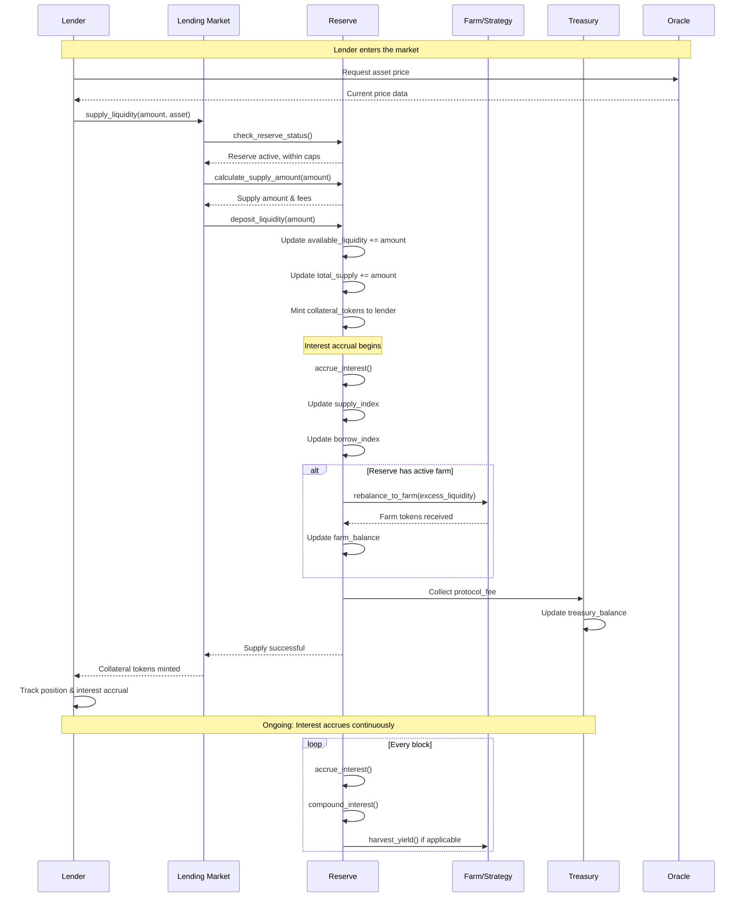
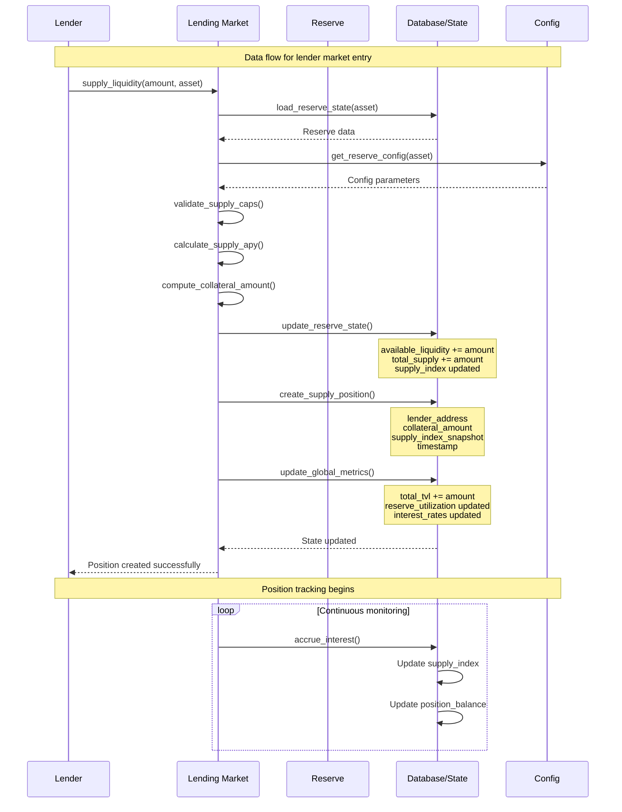
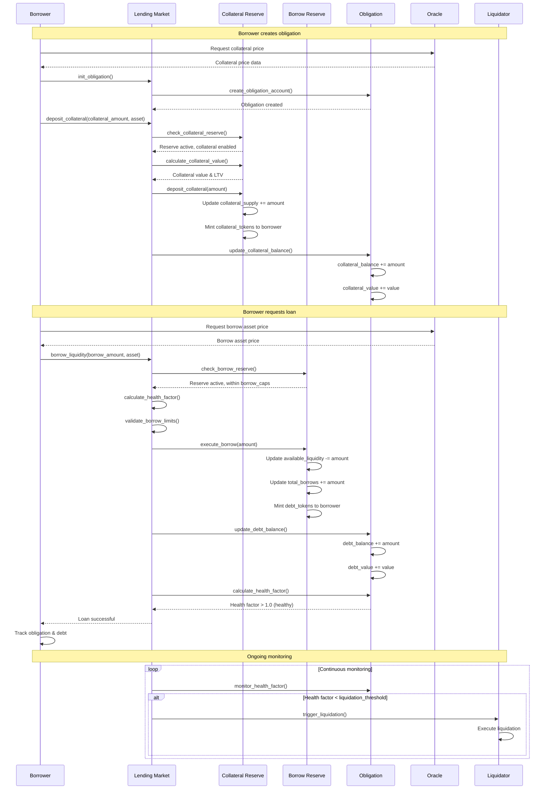
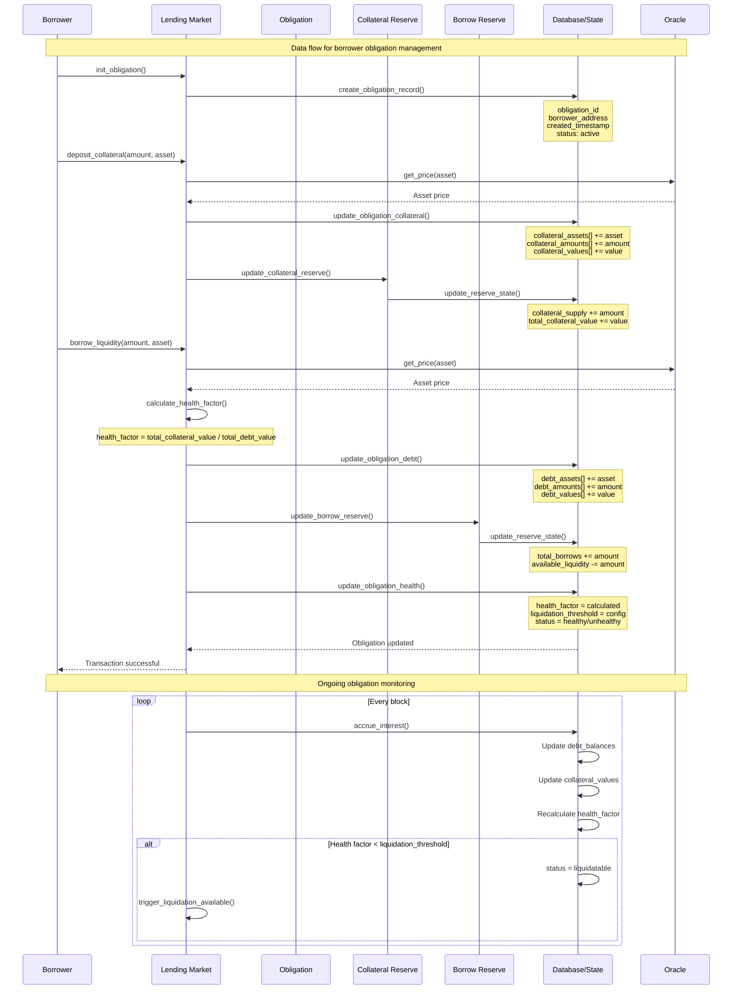

# MVP Sequence Diagrams: Lending Protocol Data & Money Flow

## Overview

This document provides sequence diagrams for the data flow and money flow in a lending protocol, focusing on the interactions between borrowers, lenders, and the protocol infrastructure. The diagrams capture the usage of obligation reserves and lending markets, showing what happens when liquidity enters the market and when borrowers create obligations.

## Architecture Components

- **Lending Market**: The primary protocol contract managing reserves and obligations
- **Reserve**: Individual asset pools with liquidity, borrow positions, and risk parameters
- **Obligation**: A borrower's position containing collateral and debt across multiple reserves
- **Lender**: Supplies liquidity to reserves in exchange for interest
- **Borrower**: Deposits collateral and borrows against it
- **Oracle**: Provides price feeds for collateral and borrowed assets
- **Liquidator**: Monitors and liquidates unhealthy positions

---

## Diagram 1: Lender Money Flow - Entering the Market

This diagram shows the complete flow when a lender supplies liquidity to a reserve, including interest accrual and potential yield farming.



---

## Diagram 2: Lender Data Flow - Market Entry

This diagram shows the data structures and state changes when a lender enters the market.



---

## Diagram 3: Borrower Money Flow - Creating Obligation

This diagram shows the complete flow when a borrower creates an obligation, deposits collateral, and borrows against it.



---

## Diagram 4: Borrower Data Flow - Obligation Management

This diagram shows the data structures and state changes when a borrower manages their obligation.



---

## Key Data Structures

### Lending Market State (Klend-based)

```rust
struct LendingMarket {
    // Market identification
    version: u64,                    // Klend uses u64, not u8
    lending_market_owner: Pubkey,    // Market owner/authority

    // Market configuration
    quote_currency: [u8; 32],        // Klend uses [u8; 32] for quote currency

    // Risk management
    risk_council: Pubkey,            // Risk management authority

    // Emergency controls
    emergency_mode: bool,            // Only emergency flag in Klend

    // Market state (minimal in Klend)
    // Note: Most state is distributed across individual reserves
    // and obligations rather than centralized in the market
}
```

**Key Differences from Generic Lending Markets:**

1. **Decentralized Architecture**: Klend doesn't maintain centralized lists of reserves or market-wide aggregations
2. **Per-Reserve Configuration**: Risk parameters, fees, and interest rates are configured per-reserve, not market-wide
3. **Advanced Risk Management**: Uses elevation groups and autodeleverage instead of simple pause/freeze mechanisms
4. **Scalability Focus**: No limits on reserves, allowing unlimited scalability
5. **Production-Ready Design**: Sophisticated risk management with advanced features like elevation groups and autodeleverage

### Reserve State

```rust
struct Reserve {
    // Liquidity management
    available_liquidity: u64,
    total_supply: u64,
    total_borrows: u64,

    // Interest accrual
    supply_index: u128,
    borrow_index: u128,
    last_update_timestamp: i64,

    // Risk parameters
    ltv: u16,
    liquidation_threshold: u16,
    liquidation_bonus: u16,

    // Caps and limits
    borrow_cap: u64,
    deposit_cap: u64,

    // Farm integration
    farm_address: Option<Pubkey>,
    farm_balance: u64,
}
```

### Obligation State

```rust
struct Obligation {
    // Borrower info
    borrower: Pubkey,
    created_at: i64,
    status: ObligationStatus,

    // Collateral tracking
    collateral_assets: Vec<Pubkey>,
    collateral_amounts: Vec<u64>,
    collateral_values: Vec<u64>,

    // Debt tracking
    debt_assets: Vec<Pubkey>,
    debt_amounts: Vec<u64>,
    debt_values: Vec<u64>,

    // Health metrics
    health_factor: u64,
    liquidation_threshold: u64,
}
```

### Supply Position

```rust
struct SupplyPosition {
    lender: Pubkey,
    reserve: Pubkey,
    collateral_amount: u64,
    supply_index_snapshot: u128,
    last_update_timestamp: i64,
}
```

---

## Protocol Instructions by Category

### Lending Market Instructions

#### Market Management

- `init_lending_market` - Initialize a new lending market
- `update_lending_market_owner` - Transfer market ownership
- `set_emergency_mode` - Enable/disable emergency mode
- `update_risk_council` - Change risk management authority

#### Market Configuration

- `update_quote_currency` - Set the quote currency for the market
- `update_market_version` - Upgrade market to new version

### Reserve Instructions

#### Reserve Lifecycle

- `init_reserve` - Initialize a new reserve for an asset
- `enable_reserve` - Activate a reserve for deposits/borrows
- `disable_reserve` - Deactivate a reserve
- `close_reserve` - Permanently close a reserve

#### Reserve Configuration

- `update_reserve_config` - Update reserve parameters (LTV, liquidation threshold, etc.)
- `update_reserve_interest_rate` - Modify interest rate model parameters
- `update_reserve_caps` - Set deposit and borrow caps
- `update_reserve_fees` - Adjust protocol and flash loan fees

#### Reserve Risk Management

- `freeze_reserve` - Temporarily freeze reserve operations
- `unfreeze_reserve` - Unfreeze reserve operations
- `pause_reserve` - Pause specific reserve functions
- `unpause_reserve` - Resume paused reserve functions

#### Reserve Integration

- `init_farms_for_reserve` - Link reserve to yield farming strategies
- `update_reserve_farm` - Modify farm configuration
- `harvest_reserve_farm` - Harvest yield from linked farms
- `rebalance_reserve_farm` - Rebalance liquidity between reserve and farms

### Obligation Instructions

#### Obligation Lifecycle

- `init_obligation` - Create a new borrower obligation
- `close_obligation` - Close an obligation (when fully repaid)
- `liquidate_obligation` - Liquidate an unhealthy obligation

#### Collateral Management

- `deposit_collateral` - Add collateral to an obligation
- `withdraw_collateral` - Remove collateral from an obligation
- `refresh_obligation_collateral` - Update collateral values and health

#### Debt Management

- `borrow_liquidity` - Borrow against collateral
- `repay_liquidity` - Repay borrowed liquidity
- `refresh_obligation_debt` - Update debt values and health

#### Obligation Health

- `refresh_obligation` - Update obligation health factor
- `calculate_obligation_health` - Calculate current health factor
- `check_liquidation_threshold` - Verify if obligation is liquidatable

### Supply Instructions

#### Supply Management

- `supply_liquidity` - Supply liquidity to a reserve
- `withdraw_liquidity` - Withdraw supplied liquidity
- `supply_liquidity_with_obligation` - Supply and use as collateral

#### Supply Configuration

- `refresh_supply_position` - Update supply position values
- `calculate_supply_apy` - Calculate current supply APY
- `update_supply_index` - Update supply interest index

### Liquidation Instructions

#### Liquidation Execution

- `liquidate_obligation` - Execute liquidation of unhealthy position
- `liquidate_obligation_and_obligation` - Cross-obligation liquidation
- `flash_liquidate` - Flash loan liquidation

#### Liquidation Configuration

- `update_liquidation_threshold` - Adjust liquidation parameters
- `set_liquidation_bonus` - Configure liquidation incentives
- `update_max_liquidation_discount` - Set maximum liquidation discount

### Oracle Instructions

#### Price Management

- `update_reserve_price` - Update asset price for a reserve
- `refresh_reserve_prices` - Update all reserve prices
- `validate_price_feed` - Verify oracle price accuracy

#### Oracle Configuration

- `set_oracle_program` - Configure oracle program for reserves
- `update_price_feed` - Change price feed source
- `set_price_confidence` - Configure price confidence thresholds

### Farm/Strategy Instructions

#### Farm Management

- `init_farm` - Initialize a new yield farming strategy
- `update_farm_config` - Modify farm parameters
- `close_farm` - Decommission a farm strategy

#### Farm Operations

- `deposit_to_farm` - Deploy liquidity to farm
- `withdraw_from_farm` - Retrieve liquidity from farm
- `harvest_farm_yield` - Collect farm rewards
- `rebalance_farm_allocation` - Adjust farm allocation

### Governance Instructions

#### Parameter Updates

- `update_global_parameters` - Modify global protocol parameters
- `update_reserve_parameters` - Change reserve-specific parameters
- `update_obligation_parameters` - Modify obligation parameters

#### Emergency Controls

- `emergency_pause` - Pause all protocol operations
- `emergency_unpause` - Resume protocol operations
- `emergency_shutdown` - Initiate emergency shutdown

### Utility Instructions

#### State Management

- `refresh_all_reserves` - Update all reserve states
- `refresh_all_obligations` - Update all obligation states
- `update_global_state` - Update global protocol state

#### Calculations

- `calculate_utilization` - Compute reserve utilization
- `calculate_health_factor` - Calculate obligation health
- `calculate_interest_rates` - Update interest rates

#### Validation

- `validate_obligation` - Verify obligation is valid
- `validate_reserve` - Check reserve configuration
- `validate_market_state` - Ensure market consistency

---

## Instruction Categories Summary

| Category           | Primary Functions                     | Key Instructions                                               |
| ------------------ | ------------------------------------- | -------------------------------------------------------------- |
| **Lending Market** | Market management, emergency controls | `init_lending_market`, `set_emergency_mode`                    |
| **Reserves**       | Asset management, risk configuration  | `init_reserve`, `update_reserve_config`, `freeze_reserve`      |
| **Obligations**    | Borrower position management          | `init_obligation`, `deposit_collateral`, `borrow_liquidity`    |
| **Supply**         | Lender position management            | `supply_liquidity`, `withdraw_liquidity`                       |
| **Liquidation**    | Risk management, position closure     | `liquidate_obligation`, `flash_liquidate`                      |
| **Oracle**         | Price feed management                 | `update_reserve_price`, `refresh_reserve_prices`               |
| **Farm**           | Yield optimization                    | `init_farm`, `harvest_farm_yield`, `rebalance_farm_allocation` |
| **Governance**     | Protocol parameter updates            | `update_global_parameters`, `emergency_pause`                  |
| **Utility**        | State management, calculations        | `refresh_all_reserves`, `calculate_health_factor`              |

---

## Money Flow Summary

### Lender Flow

1. **Entry**: Lender supplies liquidity → Reserve receives tokens → Collateral tokens minted
2. **Interest**: Continuous accrual → Supply index updates → Position value grows
3. **Yield**: Optional farm integration → Excess liquidity deployed → Additional yield earned
4. **Exit**: Collateral tokens burned → Reserve liquidity returned → Interest paid

### Borrower Flow

1. **Setup**: Obligation created → Collateral deposited → Collateral value tracked
2. **Borrow**: Loan requested → Health factor calculated → Liquidity borrowed
3. **Monitoring**: Continuous health checks → Interest accrual → Position monitoring
4. **Management**: Repayments → Additional collateral → Debt reduction

### Protocol Flow

1. **Fees**: Protocol fees collected → Treasury balance increased
2. **Risk**: Health monitoring → Liquidation triggers → Bad debt prevention
3. **Liquidity**: Reserve management → Farm integration → Yield optimization
4. **Governance**: Parameter updates → Risk management → Protocol evolution

---

## Integration Points

- **Oracle Integration**: Price feeds for all assets
- **Farm Integration**: Yield optimization for excess liquidity
- **Liquidation System**: Automated position monitoring and liquidation
- **Governance**: Parameter updates and risk management
- **Analytics**: Position tracking and protocol metrics

This MVP provides a comprehensive view of the lending protocol's data and money flows, showing how lenders and borrowers interact with the system and how the protocol manages risk and liquidity.
